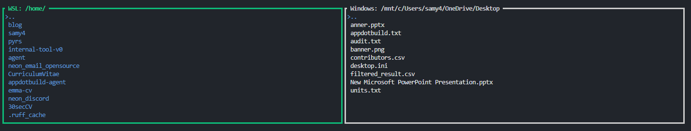

# WTW (Window to WSL / WSL to Windows)

I hate moving files between Windows and WSL, so I threw this TUI app together to quickly move files and directories.

The interface has two panes side by side:

- **WSL**: rooted at `/home/` by default  
- **Windows**: rooted at `C:\Users\samy4\OneDrive\Desktop` by default  

Navigation and copy operations are driven entirely by keyboard

---

## Overview



- Browse directories in both environments using VIM or arrow keys, then import and export using I/E keys

---

## Key Commands

- **Quit**: `q`  
- **Switch focus** (between WSL and Windows panes): `Tab`  
- **Navigate list**:  
  - `j` / `Down` → Next item  
  - `k` / `Up` → Previous item  
- **Enter directory**: `l` / `Right` / `Enter`  
- **Go up one directory**: `h` / `Left`  
- **Export** (copy from WSL to Windows): `e`  
- **Import** (copy from Windows to WSL): `i`  
  
---

## Building and Running

```bash
cargo install --locked --path .
```

Then, `wtw` will be available anywhere if `~/.cargo/bin` is on your PATH
